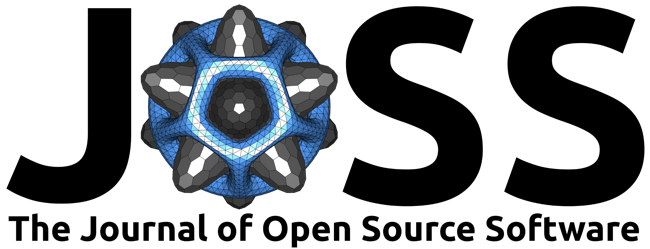

# Summary

pipeline explained: @Kreidberg2014 @Kreidberg2018 

# Statement of need

complicated... 
scanning @McCullough2012
optimal extraction @Horne1986
charge trapping @Zhou2017

# Dependencies

`numpy` [@numpy2020]
`matplotlib` [@matplotlib2007]
`scipy` [@scipy2020]
`astropy` [@astropy2013; @astropy2018]

optional:
`batman` [@Kreidberg2015]
`emcee` [@Foreman-Mackey2013]
`dynesty` [@Speagle2020]
`corner` [@corner2016]

# Documentation

# Similar tools

`Iraclis` [@Tsiaras2016]

# Future work

# How to cite

# Mathematics

$f(x) = e^{\pi/x}$

\begin{equation}\label{eq:fourier}
\hat f(\omega) = \int_{-\infty}^{\infty} f(x) e^{i\omega x} dx
\end{equation}
and refer to \autoref{eq:fourier} from text.

# Figures

Figure sizes can be customized by adding an optional second parameter: \autoref{fig:example} h

{ width=30% } { width=40% }

{ width=30% } { width=30% } { width=30% }

# Acknowledgements

We acknowledge contributions from ....

# References
